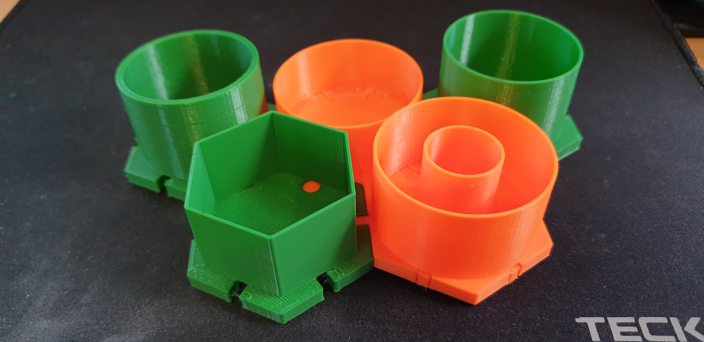

# honeycomb_organiser
OpenSCAD code for parametric honeycomb organiser

It all started with the left-over cable ties from my Prusa MK3S+ assebmly. I couldn't find a nice place to keep them on my desk when I need them. At that time I finished the last of the clingwrap in my kitchen and the inner-tube looked exactly the right diameter for holding the cable ties. All I needed was to cut it to the appropriate length and find something to prop it on - and so the honeycomb organiser was born in my mind. I could have 3D printed a tube but I thought that if I just print a holder I save on filament and I get to upcycle - a tiny contribution to saving the environment from extra waste.

The honeycomb shape allows one to print more "pods" as you need them. They slot together with a little key-connector. You can print them with the keyholes if you plan to extend your organiser or you can omit them. I use half-keys to close the keyholes while they are not used but they can be popped out when you need to connect a new pod.

